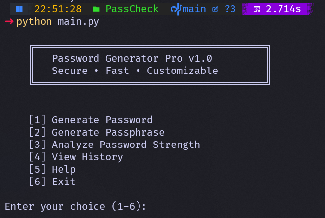

# 🔐 Password Generator Pro



A powerful command-line password generator with strength analysis built in Python. Generate secure passwords, create memorable passphrases, and analyze password strength - all from your terminal.

## ✨ Features

- 🎲 **Random Password Generation** - Create cryptographically secure passwords with customizable options
- 📝 **Passphrase Generation** - Generate memorable word-based passwords
- 📊 **Strength Analysis** - Real-time password strength scoring and recommendations
- 📜 **History Tracking** - Keep track of recently generated passwords
- ⚙️ **Highly Customizable** - Control length, character types, and exclusions
- 🎨 **Beautiful CLI Interface** - Clean and intuitive user experience

## 🚀 Installation

1. Clone this repository:
```bash
git clone https://github.com/OR-6/PassCheck.git
cd PassCheck
```

2. Install required dependencies:
```bash
pip install -r requirements.txt
```

3. Run the program:
```bash
python main.py
```

## 📖 Usage

Launch the application and choose from the following options:

### 1. Generate Password
Create a customizable random password with options for:
- Password length
- Uppercase letters
- Digits
- Special symbols
- Exclusion of ambiguous characters (il1Lo0O)

### 2. Generate Passphrase
Create memorable word-based passwords:
- Choose number of words (default: 4)
- Customize separator character
- Example: `tiger-ocean-piano-sunset`

### 3. Analyze Password Strength
Test any password and receive:
- Strength score (0-100)
- Security rating (WEAK/FAIR/GOOD/STRONG)
- Detailed improvement suggestions

### 4. View History
See your last 10 generated passwords in the current session.

## 🎯 Examples

**Strong Password:**
```
Generated Password: K9#mP$vL2@xR8nQ!
Strength Score: 95/100
Rating: STRONG
```

**Memorable Passphrase:**
```
Generated Password: thunder-ruby-guitar-ocean
Strength Score: 72/100
Rating: GOOD
```

## 🔒 Security Tips

- ✅ Use at least 12-16 characters
- ✅ Mix uppercase, lowercase, numbers, and symbols
- ✅ Avoid personal information
- ✅ Don't reuse passwords across sites
- ✅ Consider using a password manager

## 🛠️ Requirements

- Python 3.6+
- uitil library

## 📝 License

MIT License - feel free to use and modify!

## 🤝 Contributing

Contributions are welcome! Feel free to submit issues or pull requests.

## ⭐ Show Your Support

If you find this tool useful, please give it a star on GitHub!

---

**Made with ❤️ for better security**